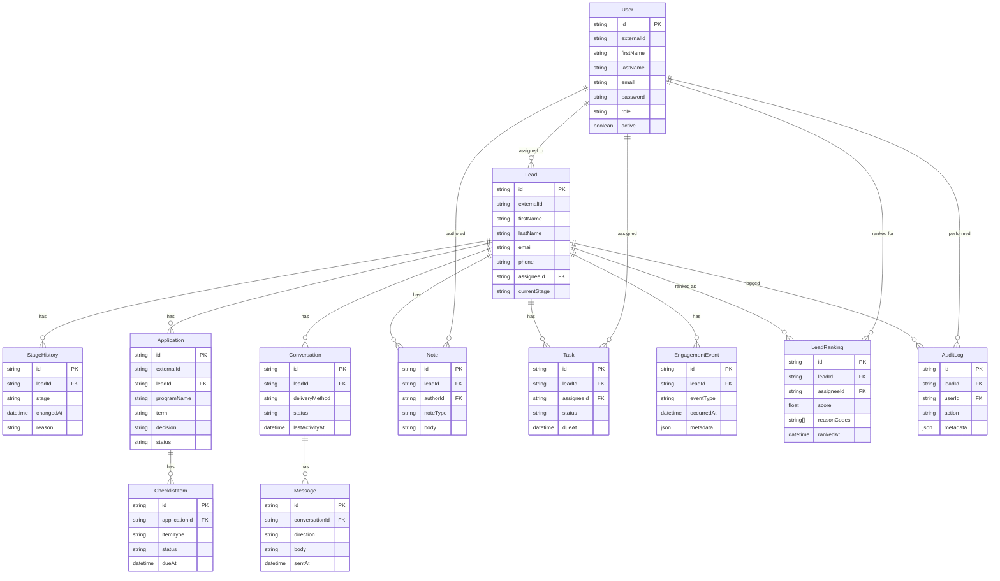

# Northstar Admissions — Data Schema

```mermaid
erDiagram
    User {
        string id PK
        string externalId
        string firstName
        string lastName
        string email
        string password
        string role
        boolean active
    }
    Lead {
        string id PK
        string externalId
        string firstName
        string lastName
        string email
        string phone
        string assigneeId FK
        string currentStage
    }
    StageHistory {
        string id PK
        string leadId FK
        string stage
        datetime changedAt
        string reason
    }
    Application {
        string id PK
        string externalId
        string leadId FK
        string programName
        string term
        string decision
        string status
    }
    ChecklistItem {
        string id PK
        string applicationId FK
        string itemType
        string status
        datetime dueAt
    }
    Conversation {
        string id PK
        string leadId FK
        string deliveryMethod
        string status
        datetime lastActivityAt
    }
    Message {
        string id PK
        string conversationId FK
        string direction
        string body
        datetime sentAt
    }
    Note {
        string id PK
        string leadId FK
        string authorId FK
        string noteType
        string body
    }
    Task {
        string id PK
        string leadId FK
        string assigneeId FK
        string status
        datetime dueAt
    }
    EngagementEvent {
        string id PK
        string leadId FK
        string eventType
        datetime occurredAt
        json metadata
    }
    LeadRanking {
        string id PK
        string leadId FK
        string assigneeId FK
        float score
        string[] reasonCodes
        datetime rankedAt
    }
    AuditLog {
        string id PK
        string leadId FK
        string userId FK
        string action
        json metadata
    }

    User ||--o{ Lead : "assigned to"
    User ||--o{ Task : "assigned"
    User ||--o{ Note : "authored"
    User ||--o{ LeadRanking : "ranked for"
    User ||--o{ AuditLog : "performed"
    Lead ||--o{ StageHistory : "has"
    Lead ||--o{ Application : "has"
    Lead ||--o{ Conversation : "has"
    Lead ||--o{ Note : "has"
    Lead ||--o{ Task : "has"
    Lead ||--o{ EngagementEvent : "has"
    Lead ||--o{ LeadRanking : "ranked as"
    Lead ||--o{ AuditLog : "logged"
    Application ||--o{ ChecklistItem : "has"
    Conversation ||--o{ Message : "has"
```